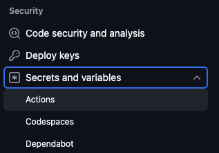
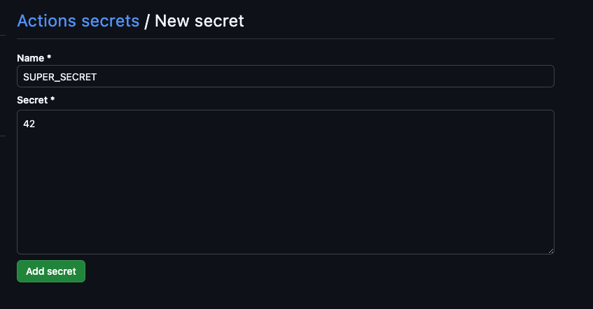

# Chapter 2 - Environment variables, secrets and more triggers

## 2.1 - Add enviromental variable

You can use environment variables to add information that you would like to reference in your workflows. Some environment variables are even predefined for you to use immediately (e.g., the person who triggered the current workflow run). To make use of these, edit the "Hello World" workflow and add the following lines:

1. Add an environment variable at the job level:

   ```yml
   greet:
     env:
       MY_ENV: "John Doe"
   ```

2. Add a second step to utilize your environment variable and a default one:

   ```yml
   - name: Run a multi-line script
     run: |
       echo "Hello $MY_ENV"
       echo "Hello $GITHUB_ACTOR"
   ```

<details>
<summary>Your workflow file (hello.yml) should now look like this:</summary>

```yml
name: Hello World Training Workflow

on:
  workflow_dispatch:

jobs:
  greet:
    env:
      MY_ENV: "John Doe"
    runs-on: ubuntu-latest
    steps:
      - name: Greet the User
        run: echo "Hello World!"
      - name: Run a multi-line script
        run: |
          echo "Hello $MY_ENV"
          echo "Hello $GITHUB_ACTOR"
```

</details>

Commit your changes and start a new run. You should see the following in the run logs (note that the second `Hello` should print your own GitHub username):


To learn more about environment variables and default variables, see [the official GitHub documentation on Environment variables](https://docs.github.com/en/actions/learn-github-actions/environment-variables).

## 2.2 - Make additional events trigger your workflow

GitHub Actions workflows can be triggered by many different types of events:

- [Events that trigger workflows](https://docs.github.com/en/actions/using-workflows/events-that-trigger-workflows)

Let's modify our workflow so that it also runs automatically whenever an issue is created in our repository. This practice is commonly referred to as "IssueOps". To achieve this, add the following to the `on` section of the workflow file and commit the changes:

```yml
---
on:
  workflow_dispatch:
  issues:
    types: [opened, edited]
```

Now create an issue in your repository and check the Actions tab. You should see the workflow run as follows:


## 2.3 - Add a secret

Last task of this chapter will be adding a secret. You can learn mode about secrets in our [documentation](), but this gist of it is, that unlinke environmental variables, we mask these strings (to a reasoable extent).

We need to start by adding a secret into a repository. Navigate to settings of the repository and then in the submenu Security, you can find Secrets and variables. We will be using secrets in Actions, so we click that.



Then we click on adding a new secret, we choose a name SUPER_SECRET and value of anything we want to keep a secret.



Note: you can also be adding a secret into an organization making it available to selected or to all repositories. More into in our [documentation](https://docs.github.com/en/enterprise-cloud@latest/actions/security-for-github-actions/security-guides/using-secrets-in-github-actions#creating-secrets-for-an-organization).

After we stored the secret, we can add it into our workflow

1. Add an environment variable tied to a secret:

   ```yml
   greet:
     env:
       MY_ENV: "John Doe"
       SUPER_SECRET: ${{ secrets.SUPER_SECRET }}
   ```

2. Modify a second step to utilize your secret:

   ```yml
   - name: Run a multi-line script
     run: |
       ..
       ..
       echo "The secret is: $SUPER_SECRET"
   ```

<details>
<summary>Your workflow file (hello.yml) should now look like this:</summary>

```yml
name: Hello World Training Workflow

on:
  workflow_dispatch:
  issues:
    types: [opened, edited]

jobs:
  greet:
    env:
      MY_ENV: "John Doe"
      MY_ENV: "John Doe"
      SUPER_SECRET: ${{ secrets.SUPER_SECRET }}
    runs-on: ubuntu-latest
    steps:
      - name: Greet the User
        run: echo "Hello World!"
      - name: Run a multi-line script
        run: |
          echo "Hello $MY_ENV"
          echo "Hello $GITHUB_ACTOR"
          echo "The secret is: $SUPER_SECRET"
```

## </details>

---

Commit your changes and try to run the workflow, either manually or via opening/editing the issue, what can you observe?

_Question, can you think of some clever ways of exfiltrating the secret? How would you do it?_

Next:

- **[Chapter 3](CH3.md)**
