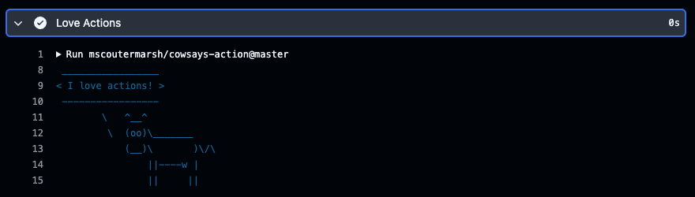

# Chapter 3 - Using Marketplace Action

## 3.1 Discovering Marketplace

If you’re eager to explore all the existing Actions created not only by GitHub but by the entire open-source community, head over to the [GitHub Marketplace](https://github.com/marketplace?category=&query=&type=actions&verification=).

Take a look at all sorts of categories of Actions, ability to filter and notice blue checkmarks next to actions that are from verified authors, these can give you a little more assurance of their origin.

## 3.2 cowsays

Let's enhance our workflow for an action to greet us by rendering and ASCII art with a cow and a message. Take a look at this fun action on our [marketplace](https://github.com/marketplace/actions/cowsays).

The Action listing usually shows how to use the action and so we have a clear example on how to print a "ship ship ship!" message with it. Take a look at the usage:

```yml
on: push

name: Cowsays

jobs:
  cow:
    name: Cowsays
    runs-on: ubuntu-latest
    steps:
      - name: Ship it
        uses: mscoutermarsh/cowsays-action@master
        with:
          text: "ship ship ship!"
          color: "red"
```

Try to amend your workflow and add another step, that will tell the world that you love actions. Do commit the code and then try to run the workflow manually and examine the output.

<details>
<summary>Your workflow file (hello.yml) should now look like this:</summary>

```yml
name: Hello World Training Workflow

on:
  workflow_dispatch:
  issues:
    types: [opened, edited]

jobs:
  greet:
    env:
      MY_ENV: "John Doe"
      SUPER_SECRET: ${{ secrets.SUPER_SECRET }}
    runs-on: ubuntu-latest
    steps:
      - name: Greet the User
        run: echo "Hello World!"
      - name: Run a multi-line script
        run: |
          echo "Hello $MY_ENV"
          echo "Hello $GITHUB_ACTOR"
          echo "The secret is: $SUPER_SECRET"
      - name: Love Actions
        uses: mscoutermarsh/cowsays-action@master
        with:
          text: "I love actions!"
          color: "red"
```

## </details>

---

If you did well, you should see the below as an output:


Next:

- **[Chapter 4](CH4.md)**
